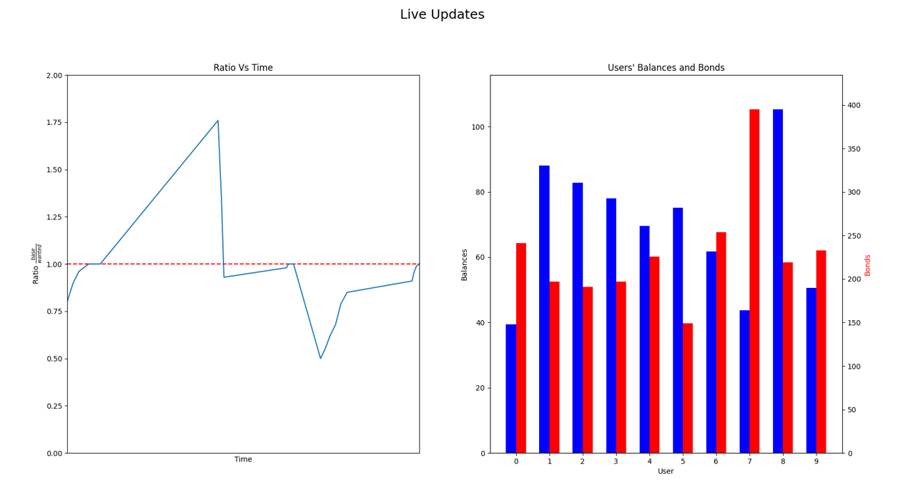

# StableCoin
Basic Non-Collateral stablecoin implementation

+ based on [base-coin](http://www.basis.io/), can also view the [base-coin-paper](http://www.basis.io/basis_whitepaper_en.pdf).

## Installation

### Requirements
+  [ganache-cli](https://github.com/trufflesuite/ganache-cli): a command-line version of Truffle's blockchain server.
+  [truffle](https://github.com/trufflesuite/truffle): development environment, for Ethereum smart contracts.


## Usage

### Run ganache test chain

```
$ gancahe-cli -p 7545
```

### Use truffle to migrate contracts to ganache test chain

```
$ truffle migrate --reset --network ganache
```

### Execute Truffle script in order to test multi users usage of Stable-Coin
```
$ truffle exec ./scripts/multi_account_test.js --network ganache 
```

### In order to use the vissualization script redirect the output to a temp file:

```
$ truffle exec ./scripts/multi_account_test.js --network ganache > temp_file.txt
```


### Visualization
```
$ python view_stats.py temp_file.txt
```


## Examples

### Visualization results


